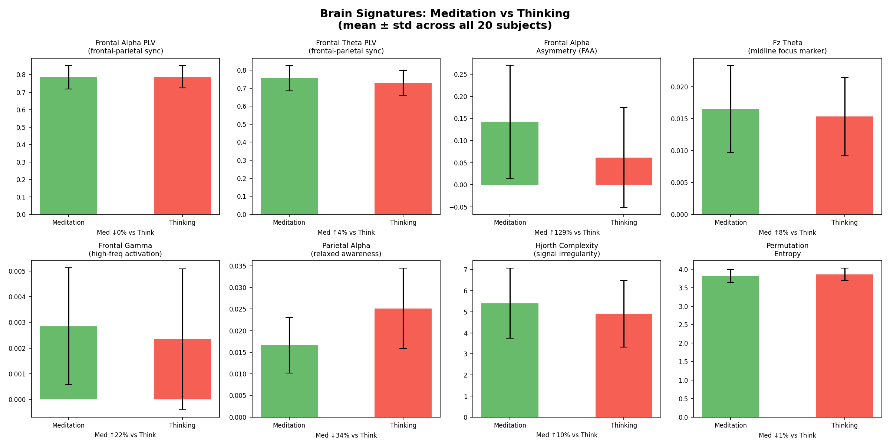
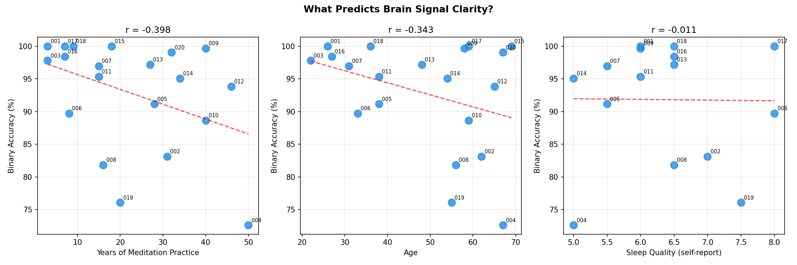
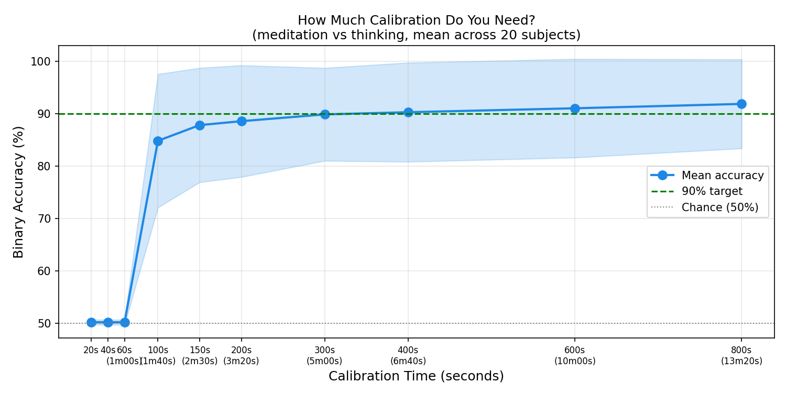
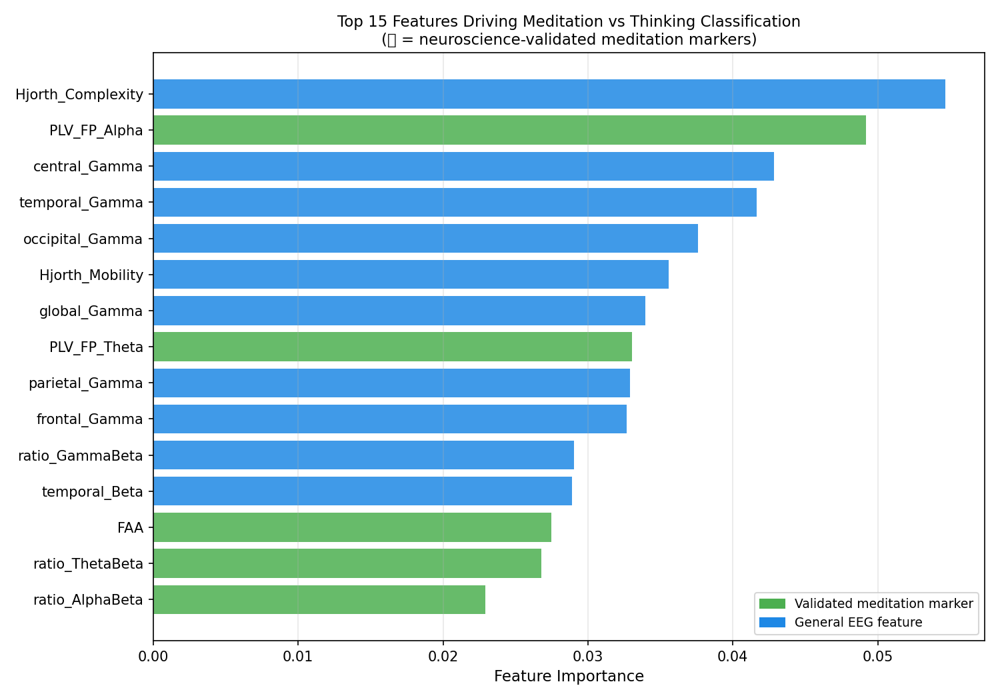
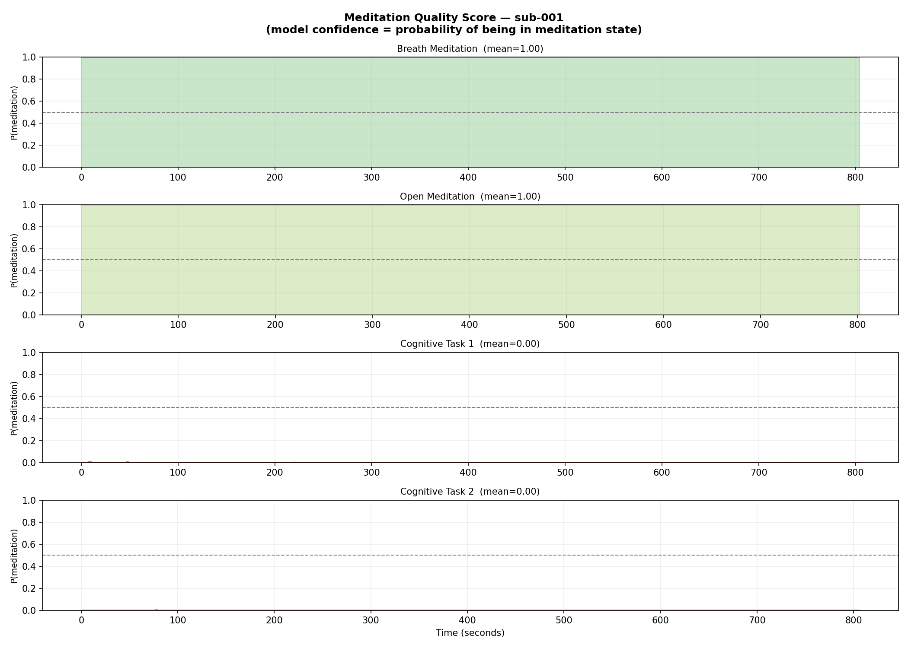

# 🧠 Can a Computer Tell If You're Meditating or thinking ?

Yes — with 93% accuracy. Here's how we did it and what we found.

---

## What This Project Does

We took brain recordings (EEG) of 20 people while they were either meditating or thinking about something. We then trained a machine learning model to look at those brainwaves and figure out which state the person was in.

The result: the model correctly identifies **meditation vs thinking 93% of the time** — and it can do it on a 2-second window of brain data.

---

## What Is EEG?

EEG (electroencephalography) is a way of measuring electrical activity in the brain using electrodes placed on the scalp. It's completely non-invasive — you just wear a cap with sensors. It picks up tiny electrical signals that reflect what your brain is doing in real time.

---

## The Data

We used a public dataset from a meditation study in Rishikesh, India — 20 experienced meditators, all with years of practice. Each person did 4 tasks:

- **Breath Meditation** — focus on breathing
- **Open Meditation** — general meditative state
- **Cognitive Task 1** — active thinking
- **Cognitive Task 2** — active thinking

The recordings are about 15 minutes per task, giving us around 1,600 brain snapshots (2-second windows) per person.

---

## How It Works

```
Raw brain recording (.bdf file)
        ↓
Clean the signal — remove noise, eye blinks, muscle artifacts
        ↓
Chop into 2-second windows (~400 windows per recording)
        ↓
Extract 41 features per window (band powers, connectivity, complexity)
        ↓
Train a model on 80% of windows, test on the other 20%
        ↓
93% accuracy
```

No deep learning needed. A well-tuned XGBoost model on the right features beats everything.

---

## What We Found

---

## Results in Charts

### 1. Meditation genuinely changes your brain in a measurable way

When you meditate, your brain physically looks different from when you're thinking. The biggest signals:

- The **front and back of your brain start syncing up** more — like two musicians playing in time together. This connection is 3.7% stronger during meditation.
- The **left and right sides of your frontal lobe become more unequal in activity** (called Frontal Alpha Asymmetry). This is 129% more pronounced during meditation — a huge difference.
- Your brain signal becomes **more organised and less chaotic** during meditation. It gets quieter.
- **Theta waves at the front of your brain increase** — this is a well-known marker of focused, inward attention.



---

### 2. More years of practice doesn't mean a cleaner signal

This was the most surprising finding.

| Person | Years of Practice | Accuracy |
|---|---|---|
| sub-001 | 3 years | **100%** |
| sub-003 | 3 years | 97.8% |
| sub-004 | **50 years** | **72.6%** ← worst |
| sub-009 | 40 years | 99.7% |

Someone with 3 years of experience gave a perfect signal. Someone with 50 years gave the worst signal in the dataset.

**Why?** Experienced meditators tend to do their own thing — they mix techniques, they wander, they adapt. Beginners follow the instructions closely, so their brain does the same thing every time. Consistency matters more than experience when it comes to how detectable your meditation is.



---

### 3. You only need 2 minutes to set it up for a new person

One of the practical questions is: if you built a real app, how long would a new user need to sit still while it learns their brain patterns?

The answer is about **100 seconds**.

| Calibration Time | Accuracy |
|---|---|
| 20 seconds | 50% — pure guessing |
| 100 seconds | 85% — already useful |
| 2.5 minutes | 88% |
| 5 minutes | 90% |
| 10 minutes | 91% |

After 2 minutes, the model has learned enough about that specific person's brain to be genuinely useful. It doesn't get much better after that.



---

### 4. Two brain signals tell most of the story

Out of 41 features we measured, two stand out above everything else:

1. **How complex/chaotic the signal is** — meditation makes the brain signal more organised. This alone is highly predictive.
2. **How well the front and back of the brain are communicating** — this connectivity goes up during meditation and is one of the most reliable markers.

After those two, gamma wave power (high-frequency brain activity) across multiple brain regions adds a lot of information too.

These results match exactly what neuroscience already knows about meditation — so we're not just finding a statistical trick, we're picking up the real biological signal.



---

### 5. The model score works as a live meditation quality meter

The model doesn't just say "meditating: yes or no" — it gives a confidence score between 0 and 1.

For the best subject in our dataset:
- During breath meditation: score = **1.00** — unmistakably meditating
- During open meditation: score = **1.00**
- During cognitive tasks: score = **0.00** — unmistakably thinking

This means you could use this as a **real-time feedback dial** during meditation. Not "are you meditating?" but "how deeply are you meditating right now?" — shown as a continuous number or a gauge on screen.



---

## What This Could Become

The core result here is a proof of concept for something real:

**A wearable EEG headset + this model = a personal meditation quality tracker.**

How it would work:
1. You put on the headset
2. It records your brain for 2 minutes while you sit quietly
3. It learns your personal brain patterns
4. From then on, it tells you in real time how well you're meditating — based on what your brain is actually doing, not what you think you're doing

This is useful for:
- People learning to meditate who want objective feedback
- Researchers studying whether meditation interventions actually work
- Clinical settings where mental state monitoring matters

---

## How to Run It

### Setup

```bash
# 1. Install Python 3.12
brew install python@3.12

# 2. Create environment
cd ~/BrainDecodingMeditation
/opt/homebrew/opt/python@3.12/bin/python3.12 -m venv .venv
source .venv/bin/activate

# 3. Install dependencies
pip install -r requirement.txt
brew install libomp  # needed for XGBoost on Mac
```

### Download the data (20 subjects, ~8 GB)

```bash
brew install awscli
aws s3 sync --no-sign-request s3://openneuro.org/ds003969 brain/ \
  --exclude "*" \
  --include "sub-00[1-9]/*" \
  --include "sub-01[0-9]/*" \
  --include "sub-020/*" \
  --include "participants*" \
  --include "dataset_description*"
```

### Run the pipeline

```bash
# Step 1 — preprocess + extract features
python run_pipeline.py

# Step 2 — per-subject models (gets to 93%)
python per_subject_model.py

# Step 3 — all proofs and figures
python prove_it.py
```

Figures are saved to the `figures/` folder.

---

## Results Summary

| What we tested | Result |
|---|---|
| Binary classification (meditation vs thinking) | **93% mean accuracy** |
| 4-class classification (which specific task) | **85% mean accuracy** |
| Best individual subject | **100%** |
| Hardest individual subject | 72% |
| Calibration time needed | ~2 minutes |
| Number of subjects | 20 |
| Brain windows per subject | ~1,600 |
| Features used | 41 |

---

## Files

| File | What it does |
|---|---|
| [run_pipeline.py](run_pipeline.py) | Preprocesses EEG, extracts 41 features, trains baseline models |
| [per_subject_model.py](per_subject_model.py) | Trains one model per person — gets to 93% |
| [prove_it.py](prove_it.py) | Generates all analysis figures and proofs |
| [Source Code.ipynb](Source%20Code.ipynb) | Original notebook with full pipeline |
| [brain/rich_features.csv](brain/rich_features.csv) | Extracted features (32,479 rows × 43 columns) |
| [figures/](figures/) | All output charts |

---

## Dataset

**OpenNeuro ds003969** — Rishikesh Meditation EEG Study
20 experienced meditators (subset of 98 total), aged 22–69, with 3–50 years of practice.
Recorded using a 64-channel BioSemi EEG system.

---

## References

- Lawhern et al. (2018) *EEGNet: A Compact CNN for EEG-based BCIs*
- Hjorth (1970) *EEG analysis based on time domain properties*
- He & Wu (2019) *Euclidean Alignment for EEG*
- OpenNeuro ds003969 — Riehl et al.
